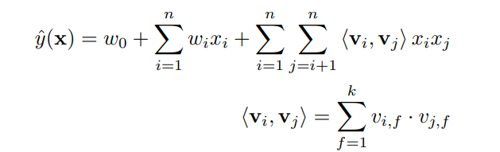
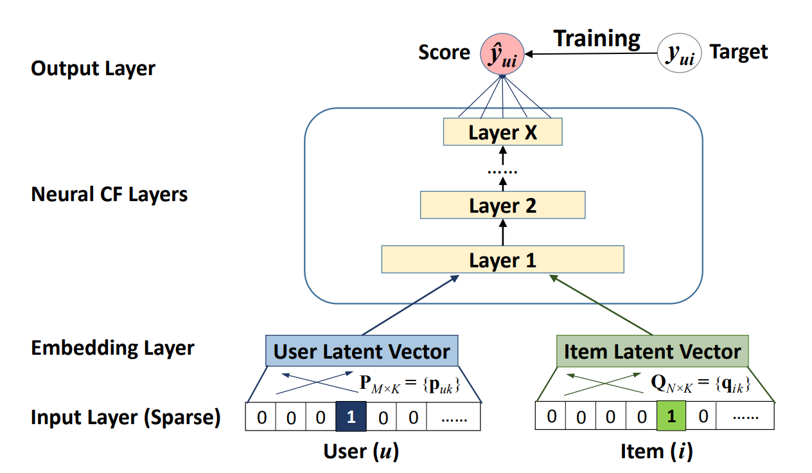

# RECOMMENDER SYSTEM PROJECT
Final project for the 2022-2023 Postgraduate course on Artificial Intelligence with Deep Learning, UPC School, authored by **Antonio Sánchez**, **Brenda Fernández**, **Evaristo Broullon** and **Joan Dayas**. 


Advised by **Paula Gómez Duran**.

Table of Contents
=================

- [RECOMMENDER SYSTEM PROJECT](#recommender-system-project)
- [Table of Contents](#table-of-contents)
	- [1. INTRODUCTION AND MOTIVATION](#1-introduction-and-motivation)
	- [2. OBJECTIVES](#2-objectives)
	- [3. STATE OF ART](#3-state-of-art)
		- [3.1 COLLABORATIVE RECOMMENDATION SYSTEM](#31-collaborative-recommendation-system)
		- [3.6 TECHNICAL INSITES](#36-technical-insites)
			- [SAMPLING TECHIQUES](#sampling-techiques)
			- [FULL RANKING](#full-ranking)
	- [4. IMPLEMENTATION](#4-implementation)
		- [4.1 DATASETS](#41-datasets)
			- [Amazon Musical Instruments](#amazon-musical-instruments)
			- [MovieLens](#movielens)
		- [4.2 MODELS](#42-models)
			- [Factorization Machine](#factorization-machine)
			- [Neural Collaborative Filtering](#neural-collaborative-filtering)
				- [General framework](#general-framework)
				- [Generalized Matriz Factorization (GMF)](#generalized-matriz-factorization-gmf)
				- [Multi-Layer Perceptron (MLP)](#multi-layer-perceptron-mlp)
				- [Fusion of GMF and MLP](#fusion-of-gmf-and-mlp)
			- [Popularity Based](#popularity-based)
			- [Random](#random)
		- [4.3 METRICS](#43-metrics)
			- [Hit ratio](#hit-ratio)
			- [NDCG](#ndcg)
			- [Coverage](#coverage)
		- [4.4 PIPELINE](#44-pipeline)
	- [5. ABLATION STUDY](#5-ablation-study)
		- [5.1 EXPERIMENT 1: epochs 12](#51-experiment-1-epochs-12)
			- [Experiment setup](#experiment-setup)
			- [Results](#results)
			- [Conclusions](#conclusions)
		- [5.2 EXPERIMENT 2: epochs 16](#52-experiment-2-epochs-16)
		- [5.X EXPERIMENT X: batch\_size 32](#5x-experiment-x-batch_size-32)
		- [5.X EXPERIMENT X: batch\_size 64](#5x-experiment-x-batch_size-64)
		- [5.X EXPERIMENT X: num\_ng 5](#5x-experiment-x-num_ng-5)
		- [5.X EXPERIMENT X: num\_ng 6](#5x-experiment-x-num_ng-6)
		- [5.X EXPERIMENT X: num\_ng 8](#5x-experiment-x-num_ng-8)
		- [5.X EXPERIMENT X: hidden\_size 64 (final)](#5x-experiment-x-hidden_size-64-final)
	- [FINAL RESULTS](#final-results)
	- [6. DEVELOPMENT](#6-development)
		- [PREPARE THE DATASET FROM SCRATCH](#prepare-the-dataset-from-scratch)
			- [Download Dataset](#download-dataset)
			- [Clean dataset](#clean-dataset)
		- [HOW TO EXTRACT OPTICAL FLOW](#how-to-extract-optical-flow)
		- [HOW TO EXTRACT FEATURES FROM VIDEOS](#how-to-extract-features-from-videos)
		- [HOW TO TRAIN THE MODEL](#how-to-train-the-model)
			- [Setting the environment in Google Drive](#setting-the-environment-in-google-drive)
			- [Running training scripts](#running-training-scripts)
		- [HOW TO RUN THE PROGRAM - video\_processor](#how-to-run-the-program---video_processor)
			- [Installation](#installation)
				- [Install Docker](#install-docker)
				- [Install docker-compose](#install-docker-compose)
				- [Install Miniconda](#install-miniconda)
				- [Create your Miniconda environment](#create-your-miniconda-environment)
				- [Create your .env file](#create-your-env-file)
			- [RUN the project](#run-the-project)
				- [??](#)
	- [CONCLUSIONS](#7-conclusions)
		- [Text](#71-text)
		- [Ethical](#72-ethical)
	- [END](#end)

---
---


## 1. INTRODUCTION AND MOTIVATION

<div align="justify">

The advancement of artificial intelligence and machine learning technologies has brought intelligent products that are essential in providing access to various endeavors of peoples’ day-to-day life. Effective and useful informationfrom massive internet data could be obtained from intelligent recommendation function of personalized recommender systems thereby making it applicable in sundry network platforms which include, movies, music as well as shop-ping platform.


It is worth noting several sectors that have suffered a greater impact: social networks are conditioned by the user's interest in publications, online commerce has the purpose of showing products that satisfy the user's needs and finally the marketing sector that with information of their clients to define the most optimal marketing action.

In general, recommender systems are algorithms based on suggesting relevant items to users.

Among the various reasons why this field is interesting to study, we found that improving the user experience encourages them to discover new products of interest. In addition, in case the recommendations are accurate, the commitment with the application is strengthened and this causes a win-win since the company captures data to improve its marketing strategies.
</div>

---
<br />
<br />

## 2. OBJECTIVES
<div align="justify">

In middle of such a variety of actual options in the market for recommender systems, the different problems, complexity and techniques used for data sampling for example, our ambition with this project is to know and understand the advantages of the main different models used today by the industry, sampling techniques and metrics to evaluate the end results of each model tested.

Due to the maturity of the existent technology, vastly used nowadays, our anchor to understand this type of system will be the FM - Factorization Machina and then extending to other models like Random, Popularity and the NCF - Neural Collaborative Filtering.

From the beginning, we could notice and understand the complexity of recommending something to a customer. There are a lot of variables involved, from the personal taste and style to a general country culture. We understand the importance of using all those context content to recognize the personal taste of a customer, but with it, we come across with a very big complexity introducing those variables in our project. Not only by the scarcity of data resources from the datasets available, but also by time to work with a context based recommender system. This is the main reason we are going to explore the “implicit feedback”, considering as positive an interaction of the customer with a product. For the negative interactions, we will need to generate it using a “negative sampling” technique commonly used by this industry. 

In a first superficial look, a recommender system can demonstrate help customers to get close with the products of their interest, but also can help companies to get users more engaged with their brand. On the other hand, instead of adopting a user-centered approach focusing on preference prediction, they shape user preferences and guide choices. This impact is significant and deserves ethical attention. 

</div>

---
<br />
<br />

## 3. STATE OF ART
### 3.1 COLLABORATIVE RECOMMENDATION SYSTEM
<div align="justify">

https://www.researchgate.net/publication/340416554_Deep_Learning_Architecture_for_Collaborative_Filtering_Recommender_Systems/link/5e8d24ed92851c2f5288696b/download

Recommender Systems (RS) are powerful tools to address the information overload problem in the Internet. They make use of diverse sources of information. Explicit votes from users to items, and implicit interactions are the basis of the Collaborative Filtering (CF) RS. According to the type of data being collected and the ways of using them in recommendation systems, the approaches for recommendation can be classified as content-based (CB), collaborative filtering (CF) and hybrid one (Koren, Bell, & Volinsky, 2009).

Implicit interactions examples are clicks, listened songs, watched movies, likes, dislikes, etc. Often, hybrid RS are designed to ensemble CF with some other types of information filtering: demographic, context-aware, content-based, social information, etc. RS cover a wide range of recommendation targets, such as travels, movies, restaurants, fashion, news, etc.

There are two kinds of collaborative filtering algorithms: user-based and item-based. User-based collaborative filtering algorithm is to recommend the items which similar users have liked while item-based one is to recommend similar items according to users’ part behaviour. Because internet products usually have much larger user number than item number, they prefer to use the item-based collaboration to the user-bases one in their recommendation system considering the computation complexity. 

CB filtering is widely used for recommendation systems design, which utilizes the content of items to create features and attributes to match user profiles. Items are compared with items previous liked by the users and the best matched items are then recommended. One major issue of CB filtering approach is that RS needs to learn user preferences for some types of items and apply these for other types of items.

</div>


### 3.6 TECHNICAL INSITES
#### SAMPLING TECHIQUES

<div align="justify">

https://arxiv.org/pdf/1706.07881.pdf

“Negative Sampling” strategy, in which k negative samples are drawn whenever a positive example is drawn. The negative samples are sampled based on the positive ones by replacing the items in the positive samples. 

</div>

#### FULL RANKING

<div align="justify">

https://arxiv.org/pdf/2107.13045.pdf

To rank a set of recommender models, we rank a target set of items for every sequence in the test set using each model. We calculate the metrics on the ranked items and then average the values for each model and rank the models using the mean. In this paper we investigate three different strategies to create the target set of items and name the ranking according to the used method to extract the target set for calculating the metrics: The one we are going to focus is the full ranking we calculate the metrics on the target set that is equal to the full item set.

</div>
<!-- ### HYPERPARAMETER TUNING
#### FACTORIZATION MACHINE
#### NEURAL COLLABORATIVE FILTERING -->

---
<br />
<br />

## 4. IMPLEMENTATION
### 4.1 DATASETS
#### Amazon Musical Instruments
https://nijianmo.github.io/amazon/index.html

This dataset is part from an updated version of the Amazon review dataset released in 2014. As in the previous version, this dataset includes reviews (ratings, text, helpfulness votes), product metadata (descriptions, category information, price, brand, and image features), and links (also viewed/also bought graphs).

This dataset provides the following features:
* The total number of clients is 903330
* The total number of products is 112222
* The total number of reviews is 1512530

#### MovieLens

### 4.2 MODELS
#### Factorization Machine
<div align="justify">

https://arxiv.org/pdf/2203.11026.pdf
https://towardsdatascience.com/factorization-machines-for-item-recommendation-with-implicit-feedback-data-5655a7c749db


To start understanding matrix factorization for recommender systems, we define the following matrices: a rating matrix R which is in general an R ∈ R m×n matrix. Each row of R represents a user and each column represents an item. The values Rui represent the rating (or score) that user u has given to item i. The problem we are trying to solve is as follows: For any collection of users and items, we have the situation where not all users have given ratings to all the items. In fact, if examined the values of R, we would find that several values are incomplete. However, we wish to recommend certain items to users. How do we do that? One way is to simply recommend any item the user has not already rated to them; this could mean sending a message to the user daily with a recommendation for an item. However, we quickly see the issue with this; if we keep recommending items to users that they don’t like, they will very quickly start ignoring our messages. We would lose credibility with the user and they may eventually unsubscribe from our messages.

There are two kinds of rating forms: implicit rating and explicit rating. Take movie recommendation as an
example:
1. Implicit: We only know the historical data whether the user watch the movie or not. The data can be represented as 0 and 1 format that 0 means un-watch and 1 means watch.
2. Explicit: Users explicitly rate all the movie they watch in the past. The data can be represented in discrete range, e.g 1, 2, · · · , 5.

Factorization Machine (FM) is designed to combine Support Vector Machine (SVM) and MF. It can handle large sparse data and subsumes MF and SVD++. FM does not only use first-order feature linear components but also second-order (cross-product) of the features to capture more potential relationship inside the features.
Suppose we have x as input matrix (rating and other features) and ˆy as output. 2-way FM can be written as equation24 which only concerns first-order and second-order feature interactions. An example of the input and output data format as figure.


<p align="center"> Example of FM’s input and output data format. </p>


<p align="center">
    
</p>

where we have three parameters: $w_0 ∈ R$, **w** $∈ R^n$, **V** $∈ R^{n×k}$ that $w_0$ is the global bias, $w_i$ models the strength of the i-th variable, $\hat{w}_{i,j} :=<\nu_i,\nu_j>$ models the interaction between the ith and j-th variable which idea is similar with FM that can do dimensionality reduction on w. We can prove the computation complexity of equation above is linear.

<p align="center">
    
</p>


</div>

#### Neural Collaborative Filtering
<div align="justify">

https://arxiv.org/pdf/1708.05031.pdf

Among the various collaborative filtering techniques, matrix factorization (MF) [14, 21] is the most popular one, which projects users and items into a shared latent space, using a vector of latent features to represent a user or an item. Thereafter a user’s interaction on an item is modelled as the inner product of their latent vectors.

To handle the absence of negative data, they have either treated all unobserved entries as negative feedback, or sampled negative instances from unobserved entries [14]. For pairwise learning [27, 44], the idea is that observed entries should be ranked higher than the unobserved ones. As such, instead of minimizing the loss between $\hat{y_{ui}}$ and ${y_{ui}}$, pairwise learning maximizes the margin between observed entry $\hat{y_{ui}}$ and unobserved entry $\hat{y_{uj}}$ .
Moving one step forward, our NCF framework parameterizes the interaction function f using neural networks to estimate $\hat{y_{ui}}$. As such, it naturally supports both pointwise and pairwise learning.


##### General framework


<p align="center">
    
</p>

Above the input layer is the embedding layer; it is a fully connected layer that projects the sparse representation to a dense vector. The obtained user (item) embedding can be seen as the latent vector for user (item) in the context of latent factor model. The user embedding and item embedding are then fed into a multi-layer neural architecture, which we term as neural collaborative filtering layers, to map
the latent vectors to prediction scores. Each layer of the neural CF layers can be customized to discover certain latent structures of user–item interactions. The dimension of the last hidden layer X determines the model’s capability. The final output layer is the predicted score $\hat{y_{ui}}$, and training is performed by minimizing the pointwise loss between $\hat{y_{ui}}$ and its target value ${y_{ui}}$.

##### Generalized Matriz Factorization (GMF)

As MF is the most popular model for recommendation and has been investigated extensively in literature, being able to recover it allows NCF to mimic a large family of factorization models [26].
Due to the one-hot encoding of user (item) ID of the input layer, the obtained embedding vector can be seen as the latent vector of user (item). Let the user latent vector $\mathbf{p}_u$ be P $\mathbf{P}^T \mathbf{v}^{U}_u$ and item latent vector $\mathbf{q}_i$ be $\mathbf{Q}^T \mathbf{v}^{I}_i$. We define the mapping function of the first neural CF layer as the product of vectors $\mathbf{p}_u$ and $\mathbf{q}_i$.

We then project the vector to the output layer: 

$$\hat{y}_{ui}=a_{out}(\mathbf{h}^T(\mathbf{p}_u · \mathbf{q}_i))$$

where ${a_{out}}$ and $\mathbf{h}$ denote the activation function and edge weights of the output layer, respectively. 


##### Multi-Layer Perceptron (MLP)

we propose to add hidden layers on the concatenated vector, using a standard MLP to learn the interaction between user and item latent features. In this sense, we can endow the model a large level of flexibility and non-linearity to learn the interactions between $\mathbf{p}_u$ and $\mathbf{q}_i$ , rather than the way of GMF that uses only a fixed element-wise product on them. More precisely, the MLP model under our NCF framework is defined as

$$\mathbf{z}_1 = \phi_1(\mathbf{p}_u,\mathbf{q}_i) = {\mathbf{p}_u  \brack \mathbf{q}_i} $$
$$ \phi_2(\mathbf{z}_1) = a_2(\mathbf{W}^{T}_2 \mathbf{z}_1 + \mathbf{b}_2) \\ 
...\\
 \phi_L(\mathbf{z}_{L-1}) = a_L(\mathbf{W}^{T}_L \mathbf{z}_{L-1} + \mathbf{b}_L) $$
$$\hat{y}_{ui}=\sigma(\mathbf{h}^T\phi_L(\mathbf{z}_{L-1}))$$

where $\mathbf{W}_x$, $\mathbf{b}_x$, and ax denote the weight matrix, bias vector, and activation function for the x-th layer’s perceptron, respectively.

##### Fusion of GMF and MLP
<p align="center">
    
	Neural matrix factorization model
</p>

A straightforward solution is to let GMF and MLP share the same embedding layer, and then combine the outputs of
their interaction functions. This way shares a similar spirit with the well-known Neural Tensor Network (NTN) [33].
Specifically, the model for combining GMF with a one-layer MLP can be formulated as 

$$\hat{y}_{ui}=\sigma(\mathbf{h}^T a(\mathbf{p}_u \bigodot \mathbf{q}_i + \mathbf{W} {\mathbf{p}_u  \brack \mathbf{q}_i}  + \mathbf{b}_L) )$$


To provide more flexibility to the fused model, we allow GMF and MLP to learn separate embeddings, and combine the two models by concatenating their last hidden layer.

$$ \phi^{GMF} = \mathbf{p}^G_u \bigodot \mathbf{q}^G_i , \\
\phi^{MLP} = a_L(\mathbf{W}^{T}_L \mathbf{z}_{L-1} + \mathbf{b}_L) , $$
$$\hat{y}_{ui}=\sigma(\mathbf{h}^T {\phi^{GMF}  \brack \phi^{MLP}} ) $$

The formulation where $\mathbf{p}^G_u$ and $\mathbf{q}^G_i$ denote the user embedding for GMF and MLP parts, respectively; and similar notations of $\mathbf{q}^G_i$ and $\mathbf{p}^G_u$ for item embeddings.

</div>

#### Popularity Based
<div align="justify">

https://www.ijeat.org/wp-content/uploads/papers/v9i3/B4660129219.pdf
https://www.analyticssteps.com/blogs/what-are-recommendation-systems-machine-learning
</div>

#### Random
??
### 4.3 METRICS
#### Hit ratio
#### NDCG
#### Coverage


### 4.4 PIPELINE

<p align="center">
    
	Project pipeline
</p>


---
<br />
<br />

## 5. ABLATION STUDY
*  Numero de epochs modifica bastante el coverage
*  Si se aumenta topk --> aumenta eficiencia pero empresarialmente no interesa recomendar más de 10 items
*  hidden_layer aparentemente no afecta
*  Si se aumenta num_ng --> aumenta eficiencia
*  Si aumenta batch_size --> disminuye eficiencia
*  Pending modificar learning rate. (paper: si usas adam este ya lo modifica)


### 5.1 EXPERIMENT 1: epochs 12
#### Experiment setup
#### Results
#### Conclusions
### 5.2 EXPERIMENT 2: epochs 16
### 5.X EXPERIMENT X: batch_size 32
### 5.X EXPERIMENT X: batch_size 64
### 5.X EXPERIMENT X: num_ng 5
### 5.X EXPERIMENT X: num_ng 6
### 5.X EXPERIMENT X: num_ng 8
### 5.X EXPERIMENT X: hidden_size 64 (final)

## FINAL RESULTS

<br />
<br />

## 6. DEVELOPMENT
### PREPARE THE DATASET FROM SCRATCH
#### Download Dataset
#### Clean dataset
### HOW TO EXTRACT OPTICAL FLOW
### HOW TO EXTRACT FEATURES FROM VIDEOS
### HOW TO TRAIN THE MODEL
#### Setting the environment in Google Drive
#### Running training scripts
### HOW TO RUN THE PROGRAM - video_processor
#### Installation
##### Install Docker
##### Install docker-compose
##### Install Miniconda
##### Create your Miniconda environment
##### Create your .env file
#### RUN the project
##### ??
## END


## 7. CONCLUSIONS
---
### 7.1 Text

### 7.2 Ethical
<div align="justify">
As far as we get deep in the ethical point applied to recommender system, we could notice this is a topic worthy to have a entire project dedicated to it just considering the different aspects envolved and the importance of it for the user, the society or even for the country.<br/>
The human being is a creature with preferences that can be a continuous variable, the complexity of implementing systems to monitor and collect those variables are extensive. This information once collected will provide data for the recommender systems. But apart from the technical side, the interests guided behind the code lines mould the nature of the system and show the limits of the ethical side of each company. It's not difficult to imagine inside the big advertisement industry, with sponsored products, brands, stores, ads and videos, the importance of the extreme care when configuring the recommender system to avoid influence in user's choice.<br/>
Recommend a product to a customer require knowledge about this person's preferences, the security issues about user data will be a very big point for discussion in data privacy area, problems that should be mitigated or avoid.<br/>
We can ask ourselves until each level companies should know about their clients?<br/>
In the end, our point of view about the ethical dilemma in recommender systems, companies should play fair with users, cover all the security issues, always be transparent with clients about the user data usage and really try to build a system to solve the user's pain, giving them support and recommending products accordingly with their interests.
</div>


<!-- 


### HOW TO TRAIN THE MODEL

#### Setting the environment

Text

#### Running training scripts

Text

### HOW TO RUN THE PROGRAM

#### Installation

Text

##### Install Miniconda

To test your installation, in your terminal window or Anaconda Prompt, run the command: 
```bash
$ conda list
```
And you should obtain the list of packages installed in your base environment.

##### Create your Miniconda environment

>  Notice: This repository has been designed in order to allow being executed with two different environments. If you have a GPU in your computer, make use of the file "environment_gpu.yml" during the next section, in case you only have CPU, use the file "environment.yml" to prepare your environment.

Execute:

```bash
 $ conda env create -f environment_gpu.yml
```

This will generate the `videoprocgpu` environment with all the required tools and packages installed.

Once your environment had been created, activate it by typing:

```bash
$ conda activate videoprocgpu
```


##### RUN the project

Text


### HOW TO RUN THE PROGRAM

Text    -->
